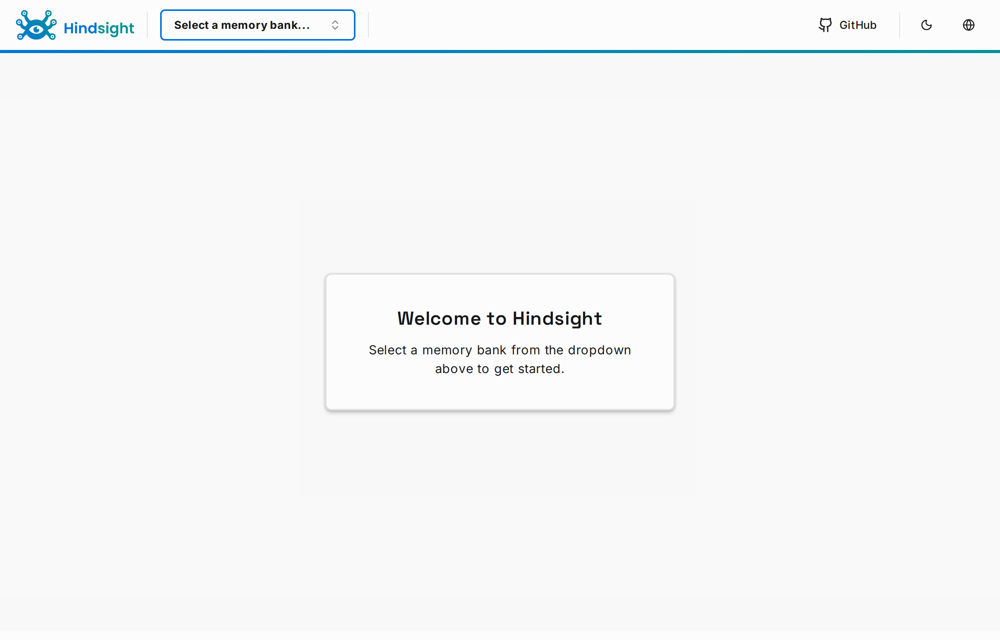

# Hindsight — Home Assistant Add-on

Runs [Hindsight](https://github.com/vectorize-io/hindsight) agent memory
(REST/MCP API + control-plane UI + embedded PostgreSQL) as a Home Assistant
add-on, optimized for low-power amd64 hosts (e.g. Intel N150). Embeddings and
reranking run locally; an [OpenRouter](https://openrouter.ai) model handles the
reasoning steps; all memory persists under `/data`.

> Single-arch (`amd64`). The embedded vector store and reasoning models are not
> built for 32-bit or ARM HA installs.



## Install

1. In Home Assistant, go to **Settings → Add-ons → Add-on Store**.
2. Open the **⋮** menu (top-right) → **Repositories**, and add:

   ```
   https://github.com/bonzanni/hindsight-ha-app
   ```

3. The **Hindsight** add-on appears in the store. Click it → **Install**.
4. On the **Configuration** tab, set your **OpenRouter API Key** (required).
5. **Start** the add-on. Once healthy, the memory browser opens from the
   sidebar (brain icon).

## Configuration

| Option | Default | What it does |
| --- | --- | --- |
| `openrouter_api_key` | _(required)_ | OpenRouter key for the reasoning LLM; the add-on will not start without it. |
| `llm_model` | `google/gemini-2.5-flash` | OpenRouter model ID for fact extraction (retain) and dialectic reasoning (recall). |
| `llm_reasoning_effort` | `low` | Effort hint for models that support it (`low`/`medium`/`high`). |
| `reranker_enabled` | `true` | Run the local cross-encoder reranker for higher-quality recall; disable to shave latency on low-power hosts. |
| `enable_ui` | `true` | Serve the control-plane UI in the sidebar; disable for a headless, API-only deployment. |
| `log_level` | `info` | Application log verbosity. |

Full option docs: [`hindsight/DOCS.md`](hindsight/DOCS.md).

## Using the API from other add-ons

Other add-ons reach the Hindsight API on the internal Docker network at:

```
http://hindsight:8888
```

Point agent add-ons or MCP clients here to retain and recall memory. The
`/health` endpoint backs the Supervisor watchdog and is safe to poll for
readiness. Port `8888` can also be mapped to the host for LAN access.

## Data & backups

All memory — the vector store and the embedded PostgreSQL cluster (`pg0`) —
lives under `/data` and is included in Home Assistant **cold backups**
automatically. Restoring a backup moves the entire memory store to a new host.

## Development & tests

- `tests/smoke.sh` — builds the image, boots it standalone, and asserts API
  health, pg0 persistence across a restart, and that the nginx ingress front
  answers. Requires `OPENROUTER_KEY` in the environment.
- `tests/run-ingress.sh` — boots the add-on behind a local HA-ingress mimic and
  runs the Playwright spec (`tests/ingress.spec.mjs`) to verify the
  control-plane renders under a dynamic ingress prefix with no broken assets.

Both expect Docker on a native Linux/WSL2 filesystem (not `/mnt/c`).

## Architecture

A hybrid image: the prebuilt Python 3.11 API venv, the Next.js control-plane,
and the preloaded ML model caches are `COPY`-ed out of the digest-pinned
upstream `ghcr.io/vectorize-io/hindsight` image into an HA
`base-debian:trixie` base (glibc 2.41 — required so pg0's pgvector loads).
s6-overlay v3 runs an init oneshot (bashio config → env), the upstream
all-in-one as a non-root user, and an nginx front that adapts the UI for HA
ingress. See [`docs/superpowers/specs`](docs/superpowers/specs) and
[`docs/superpowers/plans`](docs/superpowers/plans) for the design and build
plan.

## License

MIT — see [`LICENSE`](LICENSE).
